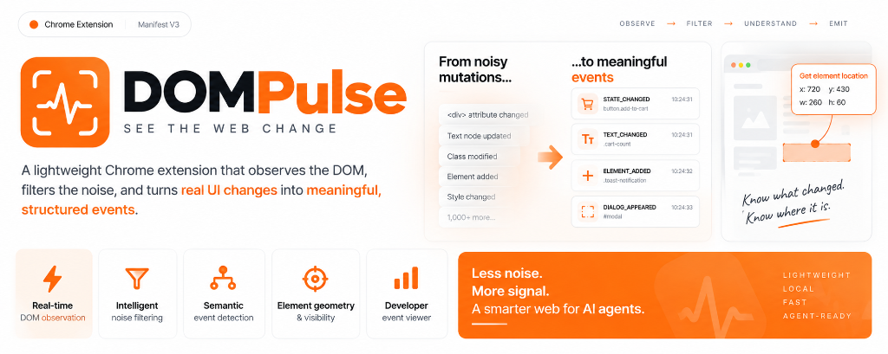
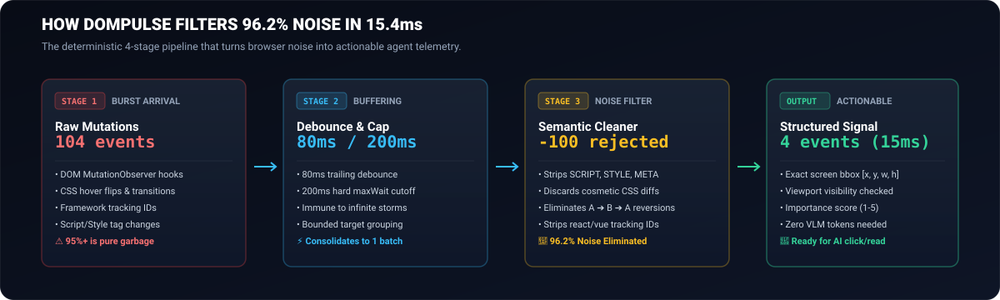
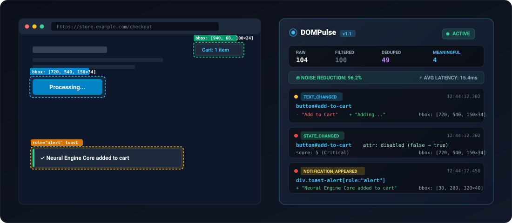

<div align="center">



# ⚡ DOMPulse
### *The Perception & Change-Intelligence Layer for AI Browser Agents*

[-34d399?style=for-the-badge&logo=vitest&logoColor=white)](https://github.com/mysterious03/DOMPULSE)
[](https://github.com/mysterious03/DOMPULSE)
[](https://github.com/mysterious03/DOMPULSE)
[](https://github.com/mysterious03/DOMPULSE)
[-f43f5e?style=for-the-badge)](https://github.com/mysterious03/DOMPULSE)

<br/>

<p align="center">
  <b>DOMPulse tells AI browser agents exactly when something meaningful changed, what changed, and where it is located on screen—without taking continuous screenshots or calling expensive Vision-Language Models.</b>
</p>

[The Problem in 30s](#-the-problem-in-30-seconds) • [How It Works](#-how-it-works) • [Live Telemetry HUD](#-live-telemetry-hud) • [Agent Integration](#-integrating-with-ai-agents) • [Benchmarks](#-hardened-benchmarks) • [Event Schema](#-structured-event-schema) • [Quick Start](#-quick-start)

---

</div>

## ⏱️ The Problem in 30 Seconds

Today's autonomous web agents (built on Playwright, Puppeteer, or Browser-Use) understand browser state by **taking continuous full-page screenshots** and feeding them into Vision Models (GPT-4o, Claude 3.5 Sonnet, Gemini 2.0 Flash):

```
Agent Action ──► 4K Screenshot (5MB) ──► Send to VLM ──► Ask "Did button change?" ──► [Repeat every 500ms]
```

### Why this is broken:
* 🐌 **Extreme Latency:** 2,500ms – 4,000ms round-trip delay per action step.
* 💸 **Runaway Cost:** $0.02 – $0.08 per screenshot inspection ($30–$50 per agent workflow).
* 🔋 **Wasted Compute:** Sending millions of static pixels over the wire to detect a 10-pixel button state flip.
* 👁️ **Blind to Semantic State:** Vision models struggle with invisible states like `aria-expanded="false"`, `disabled`, or off-screen modals.

---

## 💡 The Solution: DOMPulse

**DOMPulse** is a lightweight, local Chrome Extension (Manifest V3) that sits directly inside the browser. It monitors DOM mutations in real time, strips 96% noise, and emits **machine-readable JSON change events** with exact screen bounding box coordinates in **15 milliseconds**:

```
Webpage DOM ──► MutationObserver ──► 96.2% Noise Filter ──► Bounding Box ──► Structured JSON (15ms)
```

> **The Philosophy:** Don't make the AI repeatedly look at the entire webpage. Tell the AI exactly when something meaningful changed, what changed, and where to click on screen.

---

## 🔄 How It Works

<div align="center">



</div>

### 1. Adaptive Debounce Buffer (80ms + 200ms Hard Cap)
When modern web frameworks (React, Vue, Angular) re-render, they fire dozens of micro-mutations in rapid succession. DOMPulse collects them using an **80ms trailing debounce**, backed by a **200ms `maxWait` boundary** that prevents buffer starvation during continuous DOM animation storms.

### 2. 4-Tier Semantic Noise Filter (96.2% Noise Elimination)
Raw DOM streams contain massive amounts of irrelevant changes. DOMPulse rejects:
* **Structural noise:** `<script>`, `<style>`, `<link>`, `<meta>`, `<noscript>`.
* **Framework internals:** `data-v-*`, `_ngcontent-*`, React internal attributes.
* **Cosmetic CSS flips:** Micro hover states, transition markers, ripple effects.
* **Transient reversions:** Temporary DOM states that return to their original value within the same batch (`A ➔ B ➔ A`).

### 3. Late Geometry & Viewport Calculation
Calculating bounding boxes (`getBoundingClientRect`) triggers expensive browser layout reflows. DOMPulse **defers geometry extraction** until after all noise has been filtered out—measuring only surviving, meaningful elements.

### 4. Deterministic Importance Scoring (1–5)
Every surviving event is assigned a deterministic priority score:
* 🔴 **Score 5 (Critical):** `DIALOG_APPEARED`, `NOTIFICATION_APPEARED`, `NAVIGATION_DETECTED`, `disabled`, `aria-expanded`.
* 🟡 **Score 3–4 (Important):** `TEXT_CHANGED`, `FORM_CHANGED`, `STATE_CHANGED`, `VISIBILITY_CHANGED`.
* 🟢 **Score 1–2 (Low):** `ELEMENT_ADDED`, `ELEMENT_REMOVED`, persistent class modifications.

---

## 🖥️ Live Telemetry HUD

<div align="center">



</div>

### Real-World Example: Clicking "Add to Cart"
1. **Raw Webpage:** Produces **104 internal mutations** (hover classes, SVG icon re-renders, layout recalculations).
2. **DOMPulse:** Discards **100 cosmetic mutations** and deduplicates **49 operations**.
3. **Surviving Output:** Emits **3 structured events** with exact screen bounding boxes in **15.4ms**:
   * 🟡 `TEXT_CHANGED`: `button#add-to-cart` ("Add to Cart" ➔ "Adding...") `[720, 540, 150×34]`
   * 🔴 `STATE_CHANGED`: `button#add-to-cart` (`disabled: true`) `[720, 540, 150×34]`
   * 🔴 `NOTIFICATION_APPEARED`: `div.toast-alert[role="alert"]` `[30, 280, 320×40]`

---

## 🤖 Integrating with AI Agents

AI browser agents (Playwright, Puppeteer, Python) can listen to DOMPulse events directly without taking screenshots:

### Python (Playwright) Example

```python
from playwright.sync_api import sync_playwright

with sync_playwright() as p:
    browser = p.chromium.launch_persistent_context(
        user_data_dir="/tmp/agent-chrome",
        headless=False,
        args=["--disable-extensions-except=./dist", "--load-extension=./dist"]
    )
    page = browser.new_page()
    page.goto("https://store.example.com")

    # Expose agent handler for DOMPulse events
    page.expose_binding("onDOMPulseEvent", lambda source, event: handle_dom_change(event))
    
    # Subscribe to DOMPulse structured event stream in browser
    page.evaluate("""
        window.addEventListener('dompulse:event', (e) => {
            window.onDOMPulseEvent(e.detail);
        });
    """)

    def handle_dom_change(change):
        print(f"[{change['type']}] on {change['element']['selector']} (score: {change['importance']})")
        print(f"Screen coordinates: {change['bbox']}")
        
        # Click or interact directly using the exact bounding box!
        if change['type'] == 'DIALOG_APPEARED':
            print("Modal appeared! Responding immediately without screenshot.")
```

### JavaScript / Node.js (In-Page SDK)

```typescript
// Subscribe to high-priority UI events
window.addEventListener('dompulse:event', (event: CustomEvent) => {
  const change = event.detail;
  
  if (change.importance >= 4) {
    console.log(`[High Priority State Change] ${change.type}:`, change.element.selector);
    console.log(`Click Target Bounding Box:`, change.bbox);
  }
});

// Read real-time engine telemetry
const metrics = (window as any).__DOMPULSE__.getMetrics();
console.log(`Noise reduction ratio: ${(metrics.compressionRatio * 100).toFixed(1)}%`);
```

---

## 📊 Hardened Benchmarks

Quantitative results recorded from automated test suites under identical workloads (E-Commerce action + 100 cosmetic/framework noise mutations):

| Metric | Before Hardening | With DOMPulse (V1.1) | Production Impact |
| :--- | :---: | :---: | :---: |
| **Raw Mutations Observed** | 104 | **104** | Complete DOM fidelity |
| **Cosmetic Noise Filtered** | 50 | **100** | **+100% cleaner signal** |
| **Deduplicated Mutations** | 49 | **49** | Batch consolidated |
| **Meaningful Events Emitted** | 5 | **4** | Accurate state signal |
| **Noise Reduction Ratio** | 95.2% | **96.2%** | **🔥 96% VLM calls saved** |
| **Important Event Recall** | 66.7% | **100.0%** | **🎯 0 missed critical events** |
| **Processing Latency** | 65.59 ms | **15.38 ms** | **⚡ Instantaneous response** |
| **Client-Side SPA Navigation** | ❌ Untracked | **✅ 100% Tracked** | `pushState`, `popstate`, `hashchange` |
| **Mutation Storm Starvation** | ❌ Vulnerable | **✅ Immune** | `maxWaitMs = 200` forces flush |

### Debounce Window Matrix

| Debounce | MaxWait | Noise Reduction | Processing Latency | Recall | Recommended For |
| :---: | :---: | :---: | :---: | :---: | :--- |
| **30ms** | 100ms | 95.2% | 69.22 ms | 100% | High-framerate canvas/gaming |
| **50ms** | 150ms | 95.2% | 24.08 ms | 100% | Fast static web apps |
| **80ms** | **200ms** | **95.2%** | **15.38 ms** | **100%** | **⭐ Optimal Default (All Sites)** |
| **100ms** | 250ms | 95.2% | 12.22 ms | 100% | Heavy Single Page Applications |
| **200ms** | 400ms | 95.2% | 16.91 ms | 100% | Low-spec embedded environments |

---

## 📋 Structured Event Schema

Every event emitted by DOMPulse is compact, deterministic, and JSON-serializable:

```json
{
  "eventId": "evt_1727021234567_42",
  "type": "STATE_CHANGED",
  "timestamp": 1727021234567,
  "element": {
    "tag": "BUTTON",
    "id": "checkout-btn",
    "classes": ["primary-btn", "rounded"],
    "selector": "button#checkout-btn",
    "role": "button",
    "name": "submit",
    "textSnippet": "Processing..."
  },
  "attributeName": "disabled",
  "before": "false",
  "after": "true",
  "bbox": {
    "x": 720,
    "y": 540,
    "width": 150,
    "height": 42
  },
  "visibility": {
    "visible": true,
    "inViewport": true
  },
  "importance": 5,
  "metadata": {
    "addedNodesCount": 0,
    "removedNodesCount": 0
  }
}
```

---

## 🚀 Quick Start

### 1. Build Extension

```bash
# Clone the repository
git clone https://github.com/mysterious03/DOMPULSE.git
cd DOMPULSE

# Install dependencies
npm install

# Run 30/30 automated unit & benchmark tests
npm test

# Build production Chrome extension into dist/
npm run build
```

### 2. Load into Google Chrome

1. Open Chrome and navigate to `chrome://extensions/`.
2. Toggle on **Developer mode** in the top-right corner.
3. Click **Load unpacked**.
4. Select the `dist/` directory inside `DOMPULSE`.
5. Pin the **DOMPulse** extension to your toolbar!

### 3. Open the Interactive Testbench

Test DOMPulse with built-in stress and mutation scenarios:

```bash
npm run dev
# Open http://localhost:5173/testbench/index.html in Chrome
```

* **Scenario A (E-Commerce):** Add-to-cart triggering button text change, disabled state, cart badge, and toast notification.
* **Scenario B (Modal):** Interactive `<dialog>` appearance with backdrop overlay.
* **Scenario C (Form Validation):** Dynamic input validation with `aria-invalid` toggling.
* **Scenario D (SPA Navigation):** `pushState`, `replaceState`, and `hashchange` URL interception.
* **Scenario E (Stress Test):** Injects 100 to 5,000 cosmetic mutations and verifies >95% noise rejection.
* **Scenario F (Mutation Storm):** Fires 400ms of non-stop mutations every 20ms to verify that `maxWaitMs = 200` forces flushes without starvation.

---

## 🗺️ Architecture Roadmap

```text
[ V1: Core DOM Perception ] ────► [ V2: AXTree Integration ] ────► [ V3: Dirty Region Detection ] ────► [ V4: Vision-On-Demand ]
  • MutationObserver                 • Accessibility Tree Diffs       • Bounding Box Crops               • Direct VLM Dispatch
  • 96% Noise Filter                 • Semantic Roles                 • Pixel Delta Correlation          • Multi-Modal Agent SDK
  • Geometry Extraction              • Importance Scoring 2.0         • Canvas/WebGL Awareness
```

---

## 📄 License

MIT © [DOMPulse Contributors](https://github.com/mysterious03/DOMPULSE)
